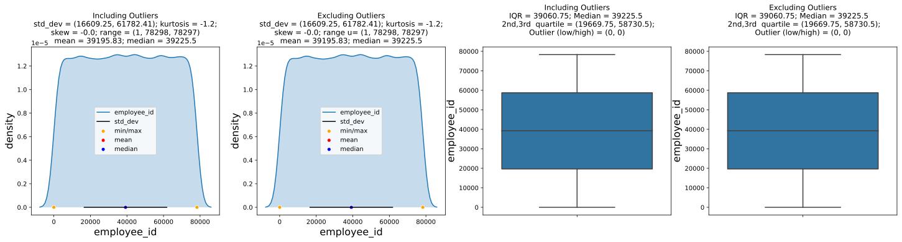
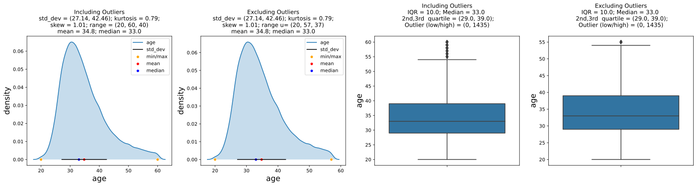
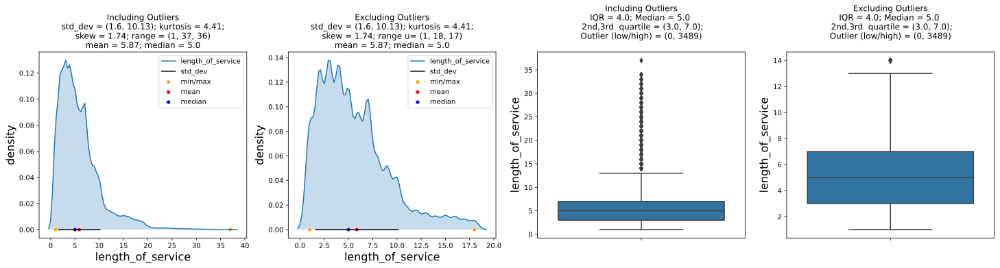
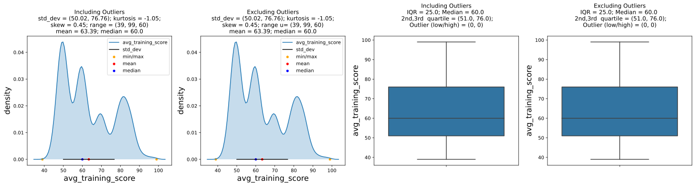
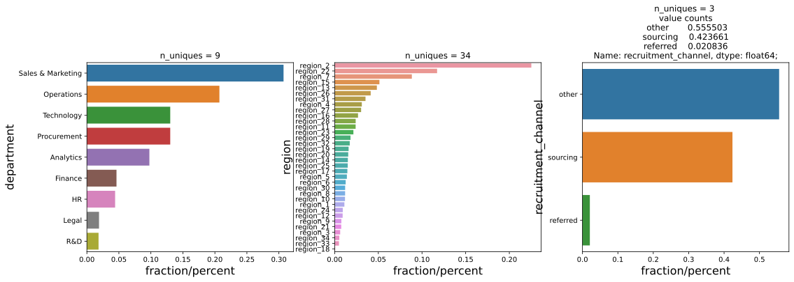
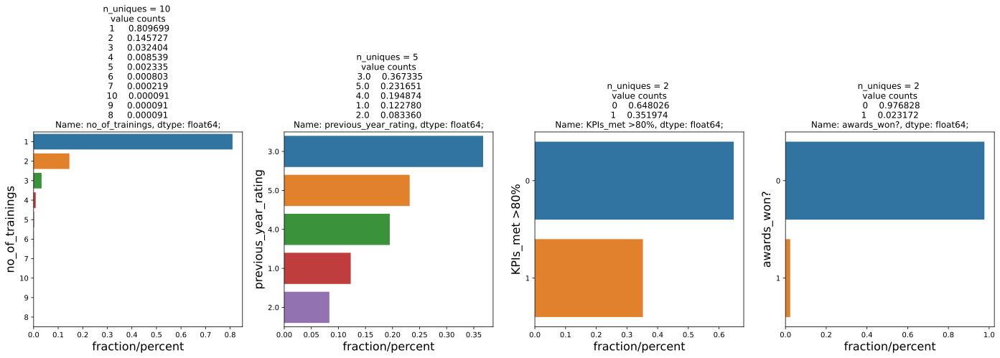

## Objective:
### To demonstrate a small set of functions which will make your life easier during Exploratory Data Analysis

### Download easy_eda in your local environment by running the following line of code


```python
# Run this cell to download easy_eda file in local environment
!wget https://raw.githubusercontent.com/SharoonSaxena/Easy-EDA/master/easy_eda.py
```

    --2020-09-08 15:14:03--  https://raw.githubusercontent.com/SharoonSaxena/Easy-EDA/master/easy_eda.py
    Resolving raw.githubusercontent.com (raw.githubusercontent.com)...151.101.152.133
    Connecting to raw.githubusercontent.com (raw.githubusercontent.com)|151.101.152.133|:443...connected.
    HTTP request sent, awaiting response...200 OK
    Length: 5965 (5.8K) [text/plain]
    Saving to: ‘easy_eda.py’
    
    easy_eda.py         100%[===================>]   5.83K  --.-KB/s    in 0.003s  
    
    2020-09-08 15:14:04 (1.83 MB/s) - ‘easy_eda.py’ saved [5965/5965]
    


### Importing libraries


```python
# importing libraries
import pandas as pd
import numpy as np
import matplotlib.pyplot as plt
import seaborn as sns

import warnings
warnings.filterwarnings(action = 'ignore')
```


```python
#importing data
data = pd.read_csv('train.csv')

##### performing variable typecasting #####

# Identifying variables with integer datatype
data.dtypes[data.dtypes == 'int64']

# converting "KPIs_met >80%" and "is_promoted" to category
data['KPIs_met >80%'] = data['KPIs_met >80%'].astype('category')
data['is_promoted'] = data['is_promoted'].astype('category')
data['no_of_trainings'] = data['no_of_trainings'].astype('category')
data['awards_won?'] = data['awards_won?'].astype('category')
data.dtypes[data.dtypes == 'int64']

# converting "previous_year_rating" to integer
data['previous_year_rating'] = data['previous_year_rating'].astype('category')

# typecasting all the object variables to category type
data['department'] = data['department'].astype('category')
data['region'] = data['region'].astype('category')
data['education'] = data['education'].astype('category')
data['gender'] = data['gender'].astype('category')
data['recruitment_channel'] = data['recruitment_channel'].astype('category')
```


```python
#Printing all the columns present in data
data.info()
```

    <class 'pandas.core.frame.DataFrame'>
    RangeIndex: 54808 entries, 0 to 54807
    Data columns (total 14 columns):
     #   Column                Non-Null Count  Dtype   
    ---  ------                --------------  -----   
     0   employee_id           54808 non-null  int64   
     1   department            54808 non-null  category
     2   region                54808 non-null  category
     3   education             52399 non-null  category
     4   gender                54808 non-null  category
     5   recruitment_channel   54808 non-null  category
     6   no_of_trainings       54808 non-null  category
     7   age                   54808 non-null  int64   
     8   previous_year_rating  50684 non-null  category
     9   length_of_service     54808 non-null  int64   
     10  KPIs_met >80%         54808 non-null  category
     11  awards_won?           54808 non-null  category
     12  avg_training_score    54808 non-null  int64   
     13  is_promoted           54808 non-null  category
    dtypes: category(10), int64(4)
    memory usage: 2.2 MB


## Univariate Analysis


```python
# Numerical datatypes
numerical = data.select_dtypes(include=['int64','float64','Int64']).dtypes.index

numerical
```


    Index(['employee_id', 'age', 'length_of_service', 'avg_training_score'], dtype='object')


### let's import univarte function for numerical variable and look at the function definition to understand how to use it


```python
# importing function for numeirical variables
from easy_eda import uva_numerical

# uncomment the following line for function definition
#uva_numerical?
```

### function definition

Signature: **uva_numerical(data, var_group, dpi=100)**

Docstring:easy and efficient analysis of numerical univariate

For any given Numerical variable, this function return 4 plots

1. KDE plot including outliers
2. KDE plot excluding outliers
3. Boxplot including outliers
4. Boxplot excluding outliers

Args:

    data (pandas.DataFrame): Data to which variable groups belong to

    var_group (list): list of numerical variables to analyse

    dpi (int > 50) : display pixel density of plots. default=100
    
Type:      function


```python
uva_numerical(data, numerical)
```














## 7. Univariate Analysis : Categorical Variables


```python
# grouping variables
employee_info = ['education','gender']
work_info = ['department', 'region', 'recruitment_channel']
merits = ['no_of_trainings', 'previous_year_rating', 'KPIs_met >80%', 'awards_won?']
```

### let's import univarte function for numerical variable and look at the function definition to understand how to use it


```python
# importing function for numeirical variables
from easy_eda import uva_categorical

# uncomment the following line for function definition
#uva_categorical?
```

### function definition

Signature: uva_categorical(data, var_group, max_uni=5, dpi=100)

Docstring:
Custom function for easy visualisation/analysis of Categorical Variables

Args:

    data (pandas.DataFrame): Data to which variable groups belong to

    var_group (list): list of categorical variables to analyse

    max_uni (int > 0) : to show frequency table only if unique categories less than max_uni

    dpi (int > 50) : display pixel density of plots. default=100

Type:      function


```python
uva_categorical(data, employee_info)
```


```python
uva_categorical(data, work_info, max_uni = 5)
```





```python
uva_categorical(data, merits, max_uni = 10)
```





# To be added:
* **Bivariate Analysis**
    * numerical_numerical
    * cateorical_categorical with hypothesis testing
    * numerical categorical with hypothesis testing
    * significance of categories in a categorical variable

*   **Multivariate analysis**


```python

```
